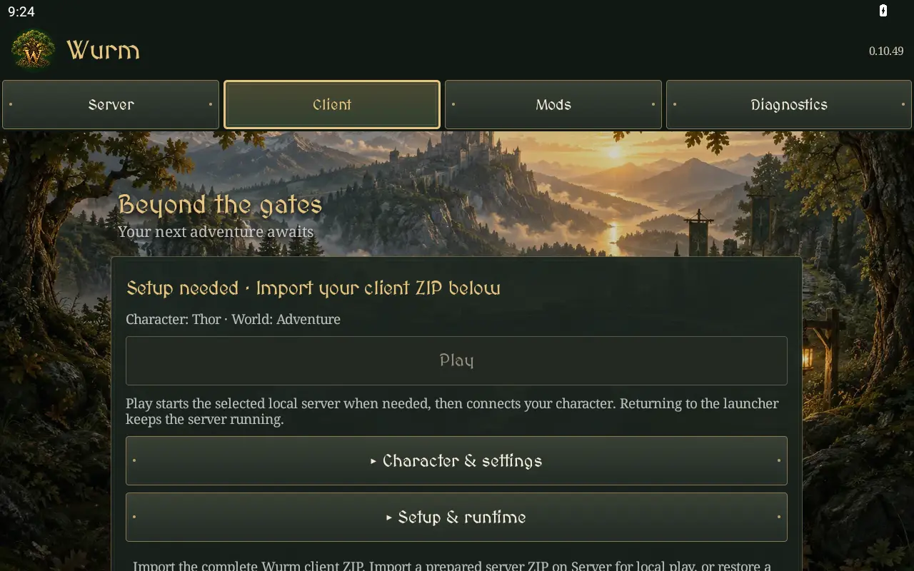

# 0.10.49 — oak and stone launcher

The user paused performance testing to request an oak/fantastical W icon, fantasy
homestead and exploration tab backgrounds, medieval lettering and castle-like
tiles. This release implements that appearance in the managed launcher.

## Appearance

- Adaptive oak-and-gold-W launcher/round icon and Android opening splash.
- Server: homestead under an oak; Client: forest bridge and distant castle;
  Mods: artisan forge; Diagnostics: explorer's map room.
- MedievalSharp headings and controls; readable serif body text and unchanged
  monospace live logs. The theme does not change the game's text or rendering.
- Dark translucent stone panels, bevelled slabs, iron-like studs, gold trim and
  distinct selected/focused/pressed/disabled states. Expanded sections retain
  their controls and original actions.
- Content centers at up to 760 dp on wide displays. Natural content heights and
  horizontal tab scrolling accommodate narrow screens and larger system text.

The fresh-install Client landscape screen renders as follows. The disabled Play
button is expected until runtime imports or a full backup are restored.

This is a UI-only software-emulator capture. Emulator Android system stalls
limited the remaining-tab, portrait and large-text review; check those on the
actual device. No performance result is inferred from this emulator.

## Asset provenance and bounds

Five original paintings were created with the built-in image generation tool.
The full prompts are in [OAK_ART_PROMPTS.md](OAK_ART_PROMPTS.md). Shipping files
are `app/src/managedPreview/res/drawable-nodpi/oak_emblem.webp` and the four
`scene_*.webp` resources. Original compositions are preserved; ImageMagick only
resizes and compresses the shipping files. The adaptive foreground uses an inset
to keep the oak and W inside launcher masks. Icon artwork is 512×512; each scene
is 1280×853. All five compressed images total about 640 KiB.

MedievalSharp is an unmodified font from
[Google Fonts](https://github.com/google/fonts/tree/main/ofl/medievalsharp),
copyright 2011 wmk69, licensed under SIL OFL 1.1. The font is bundled offline at
`app/src/managedPreview/res/font/medieval_sharp.ttf`; its complete license ships
inside the APK at `assets/licenses/MedievalSharp-OFL.txt`.

Only the selected scene has a retained bitmap reference (about 4.17 MiB at
ARGB_8888), decoded without density upscaling or the resource drawable cache.
The reference is cleared when the launcher stops, including while playing.
Replaced bitmap storage remains subject to normal Android reclamation; there is
no forced GC/recycle, animated wallpaper, per-frame decoding, blur or network
artwork loading. Icon, view and GPU memory are additional to that scene estimate.

## Scope and checks

All existing client/server ownership, four tab IDs/order, saved selection,
scroll restoration, import/export, backup and runtime paths are preserved.
Runtime-probe, native and game renderer sources are unchanged. FPS options and
the verified 0.10.48 text buffer release fix remain in place. Performance/memory
investigation resumes after visual review; this is not a performance fix.

Build, lint and independent published-APK checks passed; release details and
visual-review limits are recorded in HANDOFF.md.
If a local UI-only APK is used for emulator inspection, it deliberately omits
runtime/native preparation and must never be offered as the installable release.
The shipped APK is always produced by the complete existing CI pipeline.
This release passed that full pipeline and its downloaded signature/checksum
checks. The theme documents are in the tagged repository and build artifact;
the first release asset list omitted their standalone copies.

## Device review

Save/stop both runtimes in the working app and export a full backup. Keep that
app and backup. Install the separate `.oaktheme` app, then restore through
Backups & migration. Check the oak/W icon and splash, each tab's background,
selected tab, expanded tiles, settings dialogs and readable diagnostics in the
usual landscape orientation. Also check portrait and larger system text. Resume
an existing game normally; no new performance recording is requested yet.
